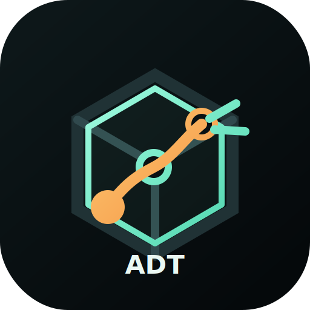
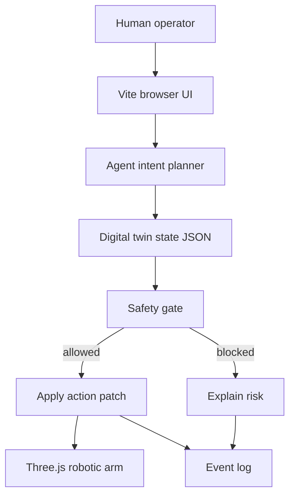
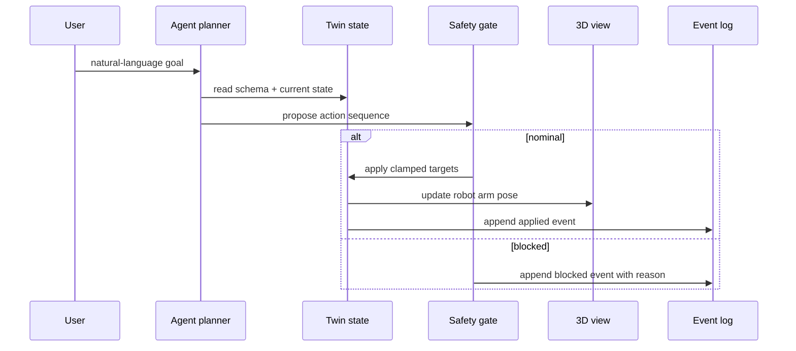

# Agentic Digital Twin

<p align="center">
  
</p>

<p align="center">
  <a href="https://nodejs.org/"></a>
  <a href="LICENSE"></a>
  <a href="https://agentic-digital-twin.vercel.app"></a>
</p>

**Agentic Digital Twin** is an open-source workbench for showing how AI agents can operate against a live digital twin before touching the physical world.

The first demo is a browser-based **robotic arm** workcell: a 3D model, joint limits, sensors, action types, safety gating, and an audit log wrapped in one small static app.

Built and maintained with support from the WhiteMirror AI Team.

## Features

- Interactive Three.js robotic arm with orbit camera and joint sliders.
- Portable digital twin schema: assets, joints, sensors, actions, agent roles, and events.
- Agentic loop: sense → plan → simulate → gate → apply → audit.
- Natural-language intent mapping for demo agent actions.
- Safety guardrail that blocks out-of-range joint targets and sensor anomalies.
- Static Vite app: no backend required for the public demo.
- Open-source-ready docs, examples, tests, CI, and package dry-run.

## Live Demo

Production demo:

<https://agentic-digital-twin.vercel.app>

Try these goals in the Agent Console:

```text
Inspect the end effector and report vibration.
Reach the assembly fixture and capture telemetry.
Emergency stop and fold into safe home mode.
```

## Quick Start

```bash
git clone <repo-url> agentic-digital-twin
cd agentic-digital-twin
npm install
npm run dev
```

Open:

<http://127.0.0.1:4188>

Build locally:

```bash
npm run verify
```

## Agent Harness

Use this instruction with a local coding or operations agent that writes or edits digital twin JSON:

```text
You are operating an Agentic Digital Twin.

Goal:
- Keep the digital twin as the source of truth for a physical or simulated workcell.
- Never apply an action until it passes joint limits, sensor envelopes, and policy checks.
- Every action must create an auditable event.

Loop:
1. Sense: read assets, joints, sensors, and latest events.
2. Plan: convert user intent into one or more action IDs.
3. Simulate: calculate target joint state without mutating the real twin.
4. Gate: run safety checks and explain any blocked action.
5. Apply: update only allowed target state.
6. Audit: append event with actor, action, status, and note.

Output:
- Proposed action IDs
- Safety result
- Updated JSON patch or explanation for why no patch was applied
```

The reusable skill file is [`skills/agentic-digital-twin-agent/SKILL.md`](skills/agentic-digital-twin-agent/SKILL.md).

## Architecture





## Project Structure

```text
src/digitalTwin.js                 Core twin schema and agent action functions
src/robotArmScene.js               Three.js robotic arm scene
src/main.js                        Browser UI controller
examples/twin.sample.json          Portable sample twin snapshot
skills/agentic-digital-twin-agent  Agent harness instruction
public/logo.svg                    Project logo
docs/                              Architecture, demo, test results
test/                              Node test suite
```

## Testing / Reproducibility

```bash
npm run lint
npm test
npm run build
npm run pack:check
```

Detailed record: [`docs/TEST_RESULTS.md`](docs/TEST_RESULTS.md).

## Deployment

This is a static Vite app. Vercel can deploy it with:

```bash
npm run build
vercel --prod
```

No server credentials are needed for the demo.

## Contributing

Good first PRs:

- Add a new workcell sample under `examples/`.
- Add more safety checks in `src/digitalTwin.js`.
- Add new Three.js fixtures or end-effectors.
- Improve accessibility and keyboard control.

Read [`CONTRIBUTING.md`](CONTRIBUTING.md) before opening a PR.

## Security

Do not submit production facility data, private CAD files, or credentials in public issues. See [`SECURITY.md`](SECURITY.md).

## License

MIT License. See [`LICENSE`](LICENSE).
