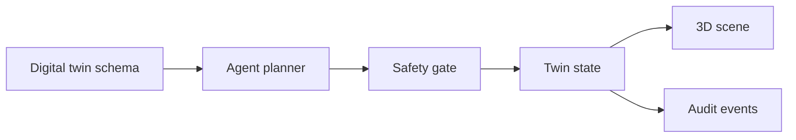

# Architecture

Agentic Digital Twin separates three concerns:

1. **Semantic twin** — JSON objects for assets, joints, sensors, actions, and events.
2. **Kinetic action layer** — action IDs map to clamped state patches.
3. **Agent loop** — user intent becomes a proposed plan; the plan is safety-gated before application.

The demo is backend-free. The browser owns the sample twin state and renders it into a Three.js scene. Production integrations should add authentication, authorization, device adapters, and independent safety controls outside this package.
